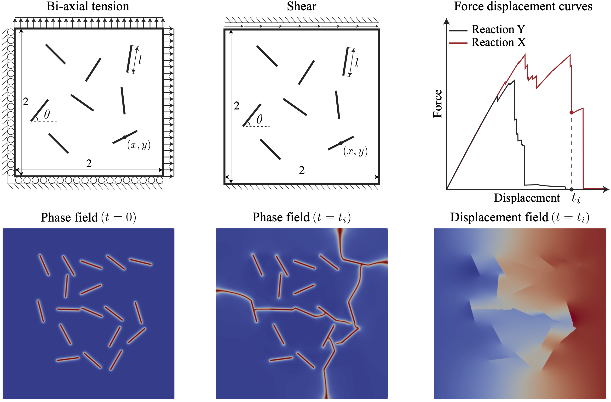
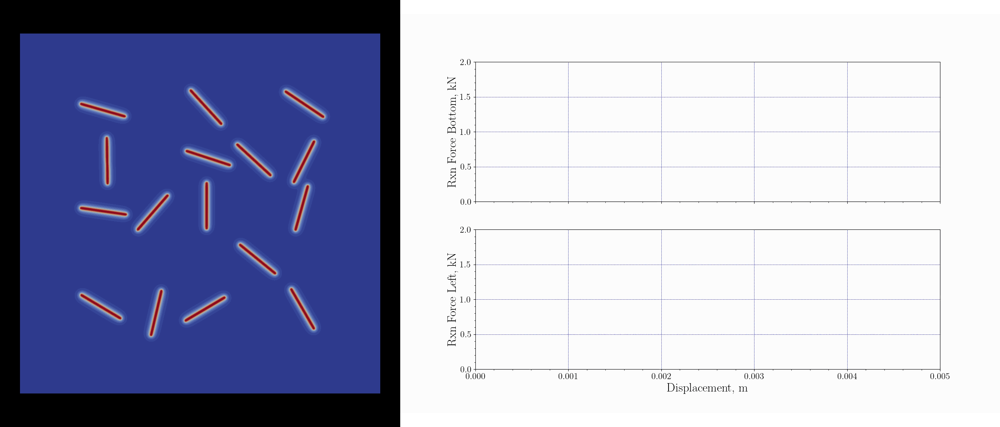

[](https://www.python.org/)


[](https://github.com/erfanhamdi/pfm_dataset/actions) 
# Phase-field fracture benchmark dataset for solid mechanics
In this work, we have implemented multiple modeling choices for PFMs, specifically multiple energy decomposition methods, and have created a diverse, and challenging dataset of crack propagation inside a domain with varying initial crack locations and boundary conditions. Specifically, the dataset includes simulations from three energy decomposition methods, two distinct boundary conditions, and 1000 sets of initial conditions. For each sample, we publish 100 time steps, capturing the temporal evolution of crack propagation and providing rich data for training and evaluating machine learning models.

This repository contains the code to reproduce the phase-field fracture benchmark dataset and the verification tests.




## Installation
* Clone the repository and create a conda environment from the environment.yml file
```bash
git clone https://github.com/erfanhamdi/pfm_dataset.git

cd pfm_dataset

conda env create --file environment.yml 

conda activate pfm-env

pip install -e .
```
## Usage
* Run the main script to generate the dataset
```bash
python src/main.py
```

## License
