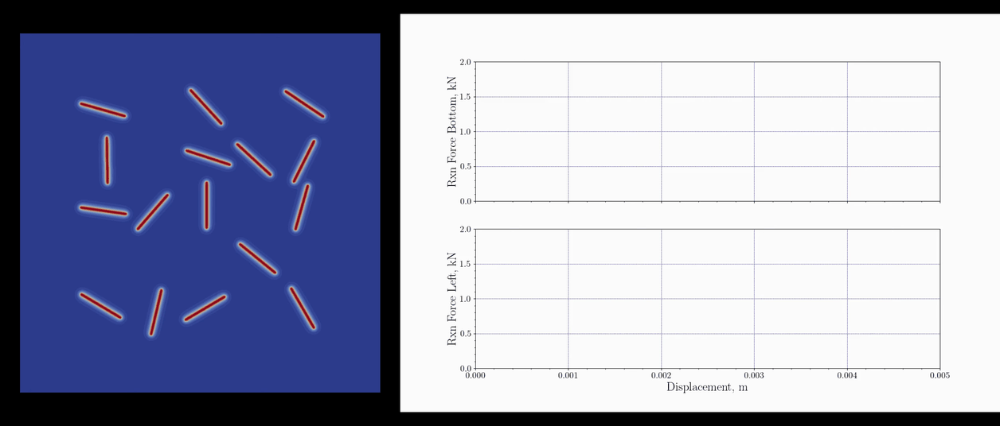

[](https://www.python.org/)


[](https://github.com/erfanhamdi/pfm_dataset/actions) 
# Phase-field fracture benchmark dataset for solid mechanics

This repository contains the code to reproduce the phase-field fracture benchmark dataset and the verification tests.




## Installation
* Clone the repository and install the package in development mode
```bash
cd pfm_dataset
pip install -e .
```
## Usage
* Run the main script to generate the dataset
```bash
python src/main.py
```

## License
